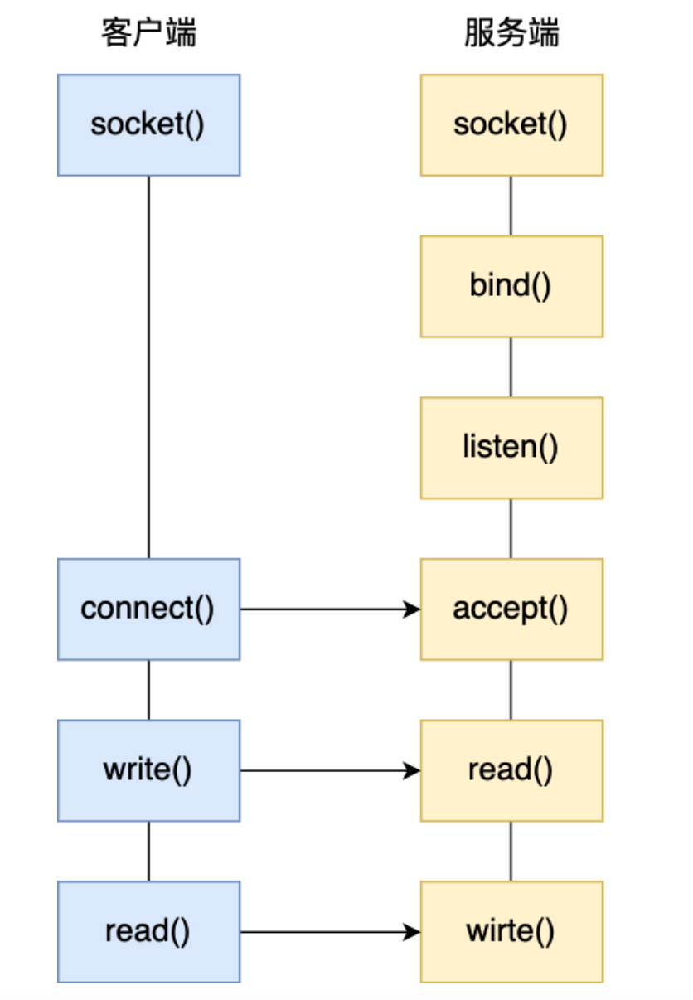
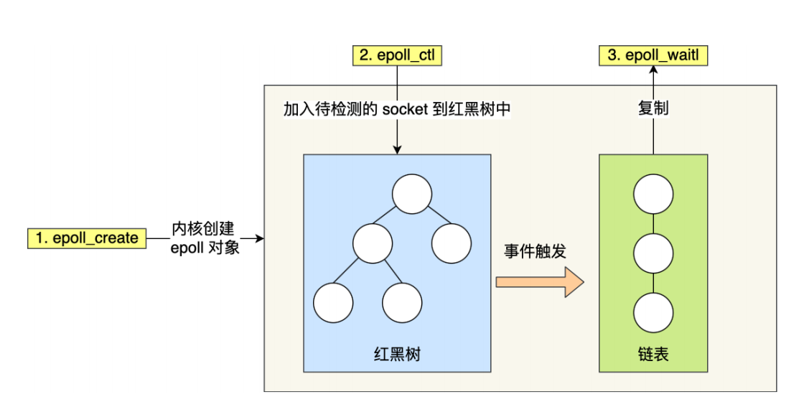

---

title: I/O 多路复⽤：select/poll/epoll
author: John Doe
tags:
  - Linux
  - IO
  - I/O多路复用
  - select/epoll/poll
categories:
  - I/O多路复用
date: 2022-03-12 19:22:00
---

最基本的 Socket 模型：要想客户端和服务器能在⽹络中通信，那必须得使⽤ Socket 编程，它是进程间通信⾥⽐较特别的⽅式，特别之处在于它是可以跨主机间通信。创建 Socket 的时候，可以指定⽹络层使⽤的是 IPv4 还是 IPv6，传输层使⽤的是 TCP 还是 UDP。

服务端⾸先调⽤ socket() 函数，创建⽹络协议为 IPv4，以及传输协议为 TCP 的 Socket ，接着调⽤
bind() 函数，给这个 Socket 绑定⼀个 IP 地址和端⼝。

绑定端⼝的⽬的：当内核收到 TCP 报⽂，通过 TCP 头⾥⾯的端⼝号，来找到我们的应⽤程序，然后把数据传递给我们。

绑定 IP 地址的⽬的：⼀台机器是可以有多个⽹卡的，每个⽹卡都有对应的 IP 地址，当绑定⼀个⽹卡时，内核在收到该⽹卡上的包，才会发给我们；

绑定完 IP 地址和端⼝后，就可以调⽤ listen() 函数进⾏监听，此时对应 TCP 状态图中的 listen ，如果
我们要判定服务器中⼀个⽹络程序有没有启动，可以通过 netstat 命令查看对应的端⼝号是否有被监听。

服务端进⼊了监听状态后，通过调⽤ accept() 函数，来从内核获取客户端的连接，如果没有客户端连
接，则会阻塞等待客户端连接的到来。

客户端在创建好 Socket 后，调⽤ connect() 函数发起连接，该函数的参数要指明服务端的 IP 地址和端⼝号，然后万众期待的 TCP 三次握⼿就开始了。

在 TCP 连接的过程中，服务器的内核实际上为每个 Socket 维护了两个队列：

⼀个是还没完全建⽴连接的队列，称为 TCP 半连接队列，这个队列都是没有完成三次握⼿的连接，

此时服务端处于 syn_rcvd 的状态；
⼀个是⼀件建⽴连接的队列，称为 TCP 全连接队列，这个队列都是完成了三次握⼿的连接，此时服务端处于 established 状态；

当 TCP 全连接队列不为空后，服务端的 accept() 函数，就会从内核中的 TCP 全连接队列⾥拿出⼀个已
经完成连接的 Socket 返回应⽤程序，后续数据传输都⽤这个 Socket。

（注意，监听的 Socket 和真正⽤来传数据的 Socket 是两个：
⼀个叫作监听 Socket；
⼀个叫作已连接 Socket；）

连接建⽴后，客户端和服务端就开始相互传输数据了，双⽅都可以通过 read() 和 write() 函数来读写数
据。

 
 
 基于 Linux ⼀切皆⽂件的理念，在内核中 Socket 也是以「⽂件」的形式存在的，也是有对应的⽂件
描述符。

上面提到的TCP Socket 调⽤流程是最简单、最基本的，它基本只能⼀对⼀通信，因为使⽤的是同步阻塞的⽅式，当服务端在还没处理完⼀个客户端的⽹络 I/O 时，或者 读写操作发⽣阻塞时，其他客户端是⽆法与服务端连接的。可如果我们服务器只能服务⼀个客户，那这样就太浪费资源了，于是我们要改进这个⽹络 I/O 模型，以⽀持更多的客户端。

服务器作为服务⽅，通常会在本地固定监听⼀个端⼝，等待客户端的连接。因此服务器的本地 IP 和端⼝是固定的，于是对于服务端 TCP 连接的四元组只有对端 IP 和端⼝是会变化的，所以最⼤ TCP 连接数 = 客户端 IP 数×客户端端⼝数。

对于 IPv4，客户端的 IP 数最多为 2 的 32 次⽅，客户端的端⼝数最多为 2 的 16 次⽅，也就是服务端单机
最⼤ TCP 连接数约为 2 的 48 次⽅。

这个理论值相当“丰满”，但是服务器肯定承载不了那么⼤的连接数，主要会受两个⽅⾯的限制：

⽂件描述符，Socket 实际上是⼀个⽂件，也就会对应⼀个⽂件描述符。在 Linux 下，单个进程打开的
⽂件描述符数是有限制的，没有经过修改的值⼀般都是 1024，不过我们可以通过 ulimit 增⼤⽂件描
述符的数⽬；

系统内存，每个 TCP 连接在内核中都有对应的数据结构，意味着每个连接都是会占⽤⼀定内存的；

基于最原始的阻塞⽹络 I/O， 如果服务器要⽀持多个客户端，其中⽐较传统的⽅式，就是使⽤多进程模型，也就是为每个客户端分配⼀个进程来处理请求。

服务器的主进程负责监听客户的连接，⼀旦与客户端连接完成，accept() 函数就会返回⼀个「已连接
Socket」，这时就通过 fork() 函数创建⼀个⼦进程，实际上就把⽗进程所有相关的东⻄都复制⼀份，包
括⽂件描述符、内存地址空间、程序计数器、执⾏的代码等。

这两个进程刚复制完的时候，⼏乎⼀摸⼀样。不过，会根据返回值来区分是⽗进程还是⼦进程，如果返回值是 0，则是⼦进程；如果返回值是其他的整数，就是⽗进程。

正因为⼦进程会复制⽗进程的⽂件描述符，于是就可以直接使⽤「已连接 Socket 」和客户端通信了，可以发现，⼦进程不需要关⼼「监听 Socket」，只需要关⼼「已连接 Socket」；⽗进程则相反，将客户
服务交给⼦进程来处理，因此⽗进程不需要关⼼「已连接 Socket」，只需要关⼼「监听 Socket」。

另外，当「⼦进程」退出时，实际上内核⾥还会保留该进程的⼀些信息，也是会占⽤内存的，如果不做好
“回收”⼯作，就会变成僵⼫进程，随着僵⼫进程越多，会慢慢耗尽我们的系统资源。

因此，⽗进程要“善后”好⾃⼰的孩⼦，怎么善后呢？那么有两种⽅式可以在⼦进程退出后回收资源，分别
是调⽤ wait() 和 waitpid() 函数。

这种⽤多个进程来应付多个客户端的⽅式，在应对 100 个客户端还是可⾏的，但是当客户端数量⾼达⼀万
时，肯定扛不住的，因为每产⽣⼀个进程，必会占据⼀定的系统资源，⽽且进程间上下⽂切换的“包袱”是
很重的，性能会⼤打折扣。

进程的上下⽂切换不仅包含了虚拟内存、栈、全局变量等⽤户空间的资源，还包括了内核堆栈、寄存器等
内核空间的资源。

既然进程间上下⽂切换的“包袱”很重，那我们就搞个⽐较轻量级的模型来应对多⽤户的请求 —— 多线程模型。

线程是运⾏在进程中的⼀个“逻辑流”，单进程中可以运⾏多个线程，同进程⾥的线程可以共享进程的部分
资源的，⽐如⽂件描述符列表、进程空间、代码、全局数据、堆、共享库等，这些共享些资源在上下⽂切
换时是不需要切换，⽽只需要切换线程的私有数据、寄存器等不共享的数据，因此同⼀个进程下的线程上
下⽂切换的开销要⽐进程⼩得多。

当服务器与客户端 TCP 完成连接后，通过 pthread_create() 函数创建线程，然后将「已连接 Socket」的
⽂件描述符传递给线程函数，接着在线程⾥和客户端进⾏通信，从⽽达到并发处理的⽬的。

如果每来⼀个连接就创建⼀个线程，线程运⾏完后，还得操作系统还得销毁线程，虽说线程切换的上写⽂
开销不⼤，但是如果频繁创建和销毁线程，系统开销也是不⼩的。

那么，我们可以使⽤线程池的⽅式来避免线程的频繁创建和销毁，所谓的线程池，就是提前创建若⼲个线
程，这样当由新连接建⽴时，将这个已连接的 Socket 放⼊到⼀个队列⾥，然后线程池⾥的线程负责从队列
中取出已连接 Socket 进程处理。

需要注意的是，这个队列是全局的，每个线程都会操作，为了避免多线程竞争，线程在操作这个队列前要
加锁。

上⾯基于进程或者线程模型的，其实还是有问题的。新到来⼀个 TCP 连接，就需要分配⼀个进程或者线
程，那么如果要达到 C10K，意味着要⼀台机器维护 1 万个连接，相当于要维护 1 万个进程/线程，操作系
统就算死扛也是扛不住的。

既然为每个请求分配⼀个进程/线程的⽅式不合适，那有没有可能只使⽤⼀个进程来维护多个 Socket 呢？
答案是有的，那就是 I/O 多路复⽤技术。

⼀个进程虽然任⼀时刻只能处理⼀个请求，但是处理每个请求的事件时，耗时控制在 1 毫秒以内，这样 1
秒内就可以处理上千个请求，把时间拉⻓来看，多个请求复⽤了⼀个进程，这就是多路复⽤，这种思想很
类似⼀个 CPU 并发多个进程，所以也叫做时分多路复⽤。

我们熟悉的 select/poll/epoll 内核提供给⽤户态的多路复⽤系统调⽤，进程可以通过⼀个系统调⽤函数从内
核中获取多个事件。

select/poll/epoll 是如何获取⽹络事件的呢？在获取事件时，先把所有连接（⽂件描述符）传给内核，再由
内核返回产⽣了事件的连接，然后在⽤户态中再处理这些连接对应的请求即可。

所以，对于 select 这种⽅式，需要进⾏ 2 次「遍历」⽂件描述符集合，⼀次是在内核态⾥，⼀个次是在⽤
户态⾥ ，⽽且还会发⽣ 2 次「拷⻉」⽂件描述符集合，先从⽤户空间传⼊内核空间，由内核修改后，再传
出到⽤户空间中。

select 使⽤固定⻓度的 BitsMap，表示⽂件描述符集合，⽽且所⽀持的⽂件描述符的个数是有限制的，在
Linux 系统中，由内核中的 FD_SETSIZE 限制， 默认最⼤值为 1024 ，只能监听 0~1023 的⽂件描述符。

poll 不再⽤ BitsMap 来存储所关注的⽂件描述符，取⽽代之⽤动态数组，以链表形式来组织，突破了
select 的⽂件描述符个数限制，当然还会受到系统⽂件描述符限制。

但是 poll 和 select 并没有太⼤的本质区别，都是使⽤「线性结构」存储进程关注的 Socket 集合，因此都
需要遍历⽂件描述符集合来找到可读或可写的 Socket，时间复杂度为 O(n)，⽽且也需要在⽤户态与内核
态之间拷⻉⽂件描述符集合，这种⽅式随着并发数上来，性能的损耗会呈指数级增⻓。

epoll 通过两个⽅⾯，很好解决了 select/poll 的问题。

第⼀点，epoll 在内核⾥使⽤红⿊树来跟踪进程所有待检测的⽂件描述字，把需要监控的 socket 通过
epoll_ctl() 函数加⼊内核中的红⿊树⾥，红⿊树是个⾼效的数据结构，增删查⼀般时间复杂度是
O(logn) ，通过对这棵⿊红树进⾏操作，这样就不需要像 select/poll 每次操作时都传⼊整个 socket 集
合，只需要传⼊⼀个待检测的 socket，减少了内核和⽤户空间⼤量的数据拷⻉和内存分配。

第⼆点， epoll 使⽤事件驱动的机制，内核⾥维护了⼀个链表来记录就绪事件，当某个 socket 有事件发⽣
时，通过回调函数内核会将其加⼊到这个就绪事件列表中，当⽤户调⽤ epoll_wait() 函数时，只会返回有
事件发⽣的⽂件描述符的个数，不需要像 select/poll 那样轮询扫描整个 socket 集合，⼤⼤提⾼了检测的效
率。

 
 
 epoll 的⽅式即使监听的 Socket 数量越多的时候，效率不会⼤幅度降低，能够同时监听的 Socket 的数⽬
也⾮常的多了，上限就为系统定义的进程打开的最⼤⽂件描述符个数。因⽽，epoll 被称为解决 C10K 问
题的利器。

（注意：epoll_wait 返回时，对于就绪的事件，epoll使⽤的是共享内存的⽅式，
即⽤户态和内核态都指向了就绪链表，所以就避免了内存拷⻉消耗。
这是错的！看过 epoll 内核源码的都知道，压根就没有使⽤共享内存这个玩意。你可以从下⾯这份代码看
到， epoll_wait 实现的内核代码中调⽤了 __put_user 函数，这个函数就是将数据从内核拷⻉到⽤户空
间。）

epoll ⽀持两种事件触发模式，分别是边缘触发（edge-triggered，ET）和⽔平触发（level-triggered，
LT）。

使⽤边缘触发模式时，当被监控的 Socket 描述符上有可读事件发⽣时，服务器端只会从 epoll_wait
中苏醒⼀次，即使进程没有调⽤ read 函数从内核读取数据，也依然只苏醒⼀次，因此我们程序要保
证⼀次性将内核缓冲区的数据读取完；

使⽤⽔平触发模式时，当被监控的 Socket 上有可读事件发⽣时，服务器端不断地从 epoll_wait 中苏
醒，直到内核缓冲区数据被 read 函数读完才结束，⽬的是告诉我们有数据需要读取；

举个例⼦，你的快递被放到了⼀个快递箱⾥，如果快递箱只会通过短信通知你⼀次，即使你⼀直没有去
取，它也不会再发送第⼆条短信提醒你，这个⽅式就是边缘触发；如果快递箱发现你的快递没有被取出，
它就会不停地发短信通知你，直到你取出了快递，它才消停，这个就是⽔平触发的⽅式。

这就是两者的区别，⽔平触发的意思是只要满⾜事件的条件，⽐如内核中有数据需要读，就⼀直不断地把
这个事件传递给⽤户；⽽边缘触发的意思是只有第⼀次满⾜条件的时候才触发，之后就不会再传递同样的
事件了。

如果使⽤⽔平触发模式，当内核通知⽂件描述符可读写时，接下来还可以继续去检测它的状态，看它是否
依然可读或可写。所以在收到通知后，没必要⼀次执⾏尽可能多的读写操作。

如果使⽤边缘触发模式，I/O 事件发⽣时只会通知⼀次，⽽且我们不知道到底能读写多少数据，所以在收到
通知后应尽可能地读写数据，以免错失读写的机会。因此，我们会循环从⽂件描述符读写数据，那么如果
⽂件描述符是阻塞的，没有数据可读写时，进程会阻塞在读写函数那⾥，程序就没办法继续往下执⾏。所
以，边缘触发模式⼀般和⾮阻塞 I/O 搭配使⽤，程序会⼀直执⾏ I/O 操作，直到系统调⽤（如 read 和
write ）返回错误，错误类型为 EAGAIN 或 EWOULDBLOCK 。

⼀般来说，边缘触发的效率⽐⽔平触发的效率要⾼，因为边缘触发可以减少 epoll_wait 的系统调⽤次数，
系统调⽤也是有⼀定的开销的的，毕竟也存在上下⽂的切换。

select/poll 只有⽔平触发模式，epoll 默认的触发模式是⽔平触发，但是可以根据应⽤场景设置为边缘触发
模式。

另外，使⽤ I/O 多路复⽤时，最好搭配⾮阻塞 I/O ⼀起使⽤，简单点理解，就是多路复⽤ API 返回的事件并不⼀定可读写的，如果使⽤阻塞 I/O， 那么在调⽤read/write 时则会发⽣程序阻塞，因此最好搭配⾮阻塞 I/O，以便应对极少数的特殊情况。

最基础的 TCP 的 Socket 编程，它是阻塞 I/O 模型，基本上只能⼀对⼀通信，那为了服务更多的客户端，
我们需要改进⽹络 I/O 模型。

⽐较传统的⽅式是使⽤多进程/线程模型，每来⼀个客户端连接，就分配⼀个进程/线程，然后后续的读写都
在对应的进程/线程，这种⽅式处理 100 个客户端没问题，但是当客户端增⼤到 10000 个时，10000 个进
程/线程的调度、上下⽂切换以及它们占⽤的内存，都会成为瓶颈。

为了解决上⾯这个问题，就出现了 I/O 的多路复⽤，可以只在⼀个进程⾥处理多个⽂件的 I/O，Linux 下有
三种提供 I/O 多路复⽤的 API，分别是： select、poll、epoll。

select 和 poll 并没有本质区别，它们内部都是使⽤「线性结构」来存储进程关注的 Socket 集合。
在使⽤的时候，⾸先需要把关注的 Socket 集合通过 select/poll 系统调⽤从⽤户态拷⻉到内核态，然后由
内核检测事件，当有⽹络事件产⽣时，内核需要遍历进程关注 Socket 集合，找到对应的 Socket，并设置
其状态为可读/可写，然后把整个 Socket 集合从内核态拷⻉到⽤户态，⽤户态还要继续遍历整个 Socket 集
合找到可读/可写的 Socket，然后对其处理。

很明显发现，select 和 poll 的缺陷在于，当客户端越多，也就是 Socket 集合越⼤，Socket 集合的遍历和拷⻉会带来很⼤的开销，因此也很难应对 C10K。

epoll 是解决 C10K 问题的利器，通过两个⽅⾯解决了 select/poll 的问题。

epoll 在内核⾥使⽤「红⿊树」来关注进程所有待检测的 Socket，红⿊树是个⾼效的数据结构，增删
查⼀般时间复杂度是 O(logn)，通过对这棵⿊红树的管理，不需要像 select/poll 在每次操作时都传⼊
整个 Socket 集合，减少了内核和⽤户空间⼤量的数据拷⻉和内存分配。

epoll 使⽤事件驱动的机制，内核⾥维护了⼀个「链表」来记录就绪事件，只将有事件发⽣的 Socket
集合传递给应⽤程序，不需要像 select/poll 那样轮询扫描整个集合（包含有和⽆事件的 Socket ），
⼤⼤提⾼了检测的效率。

⽽且，epoll ⽀持边缘触发和⽔平触发的⽅式，⽽ select/poll 只⽀持⽔平触发，⼀般⽽⾔，边缘触发的⽅式
会⽐⽔平触发的效率⾼。