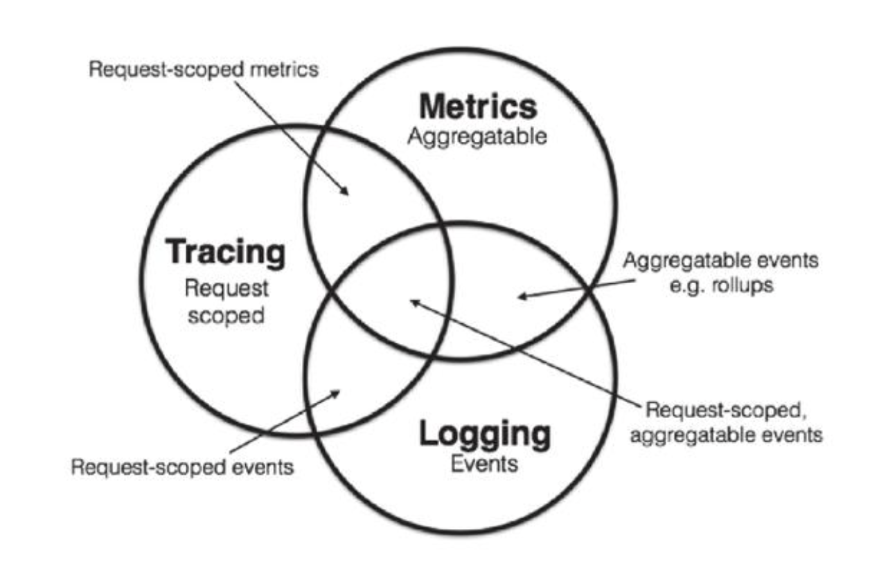

---

title: 可观测性
author: John Doe
tags:
  - 分布式
  - 可观测性
categories:
  - 分布式
date: 2022-07-29 15:41:00
---
可观测性即：可以由外部输出推断其内部状态。具体可以分解为：事件日志、链路追踪以及聚合度量三部分，这三个方向各有侧重，又有重合或者可以结合支出。

 
 
 “日志（Logging）：日志的职责是记录离散事件，通过这些记录分析出程序的行为，譬如曾经调用过什么方法，曾经操作过哪些数据，等等。输出日志很容易，但收集和分析日志可能会很复杂，面对成千上万的集群节点，面对迅速滚动的事件信息，面对以TB计算的文本，传输与归集并不简单。对大多数程序员来说，分析日志也许就是最常遇见也最有实践可行性的“大数据系统”了。”

“·追踪（Tracing）：单体系统时代追踪的范畴基本只局限于栈追踪（Stack Tracing），例如调试程序时，在IDE打个断点，看到的调用栈视图上的内容便是追踪；编写代码时，处理异常调用了Exception::printStackTrace()方法，它输出的堆栈信息也是追踪。微服务时代，追踪就不只局限于调用栈了，一个外部请求需要内部若干服务的联动响应，这时候完整的调用轨迹将跨越多个服务，同时包括服务间的网络传输信息与各个服务内部的调用堆栈信息，因此，分布式系统中的追踪在国内常被称为“全链路追踪”（后文简称“链路追踪”），许多资料中也称它为“分布式追踪”（Distributed Tracing）。追踪的主要目的是排查故障，如分析调用链的哪一部分、哪个方法出现错误或阻塞，输入输出是否符合预期，等等。”

“度量（Metrics）：度量是指对系统中某一类信息的统计聚合。譬如，证券市场的每一只股票都会定期公布财务报表，通过财报上的营收、净利、毛利、资产、负载等一系列数据来体现过去一个财务周期中公司的经营状况，这便是一种信息聚合。Java天生自带一种基本的度量，即由虚拟机直接提供的JMX（Java Management eXtensions）度量，诸如内存大小、各分代的用量、峰值的线程数、垃圾收集的吞吐量、频率等都可以从JMX中获得。度量的主要目的是监控（Monitoring）和预警（Alert），如在某些度量指标达到风险阈值时触发事件，以便自动处理或者提醒管理员介入。”

“追踪方面的情况与日志、度量有所不同，追踪是与具体网络协议、程序语言密切相关的。收集日志不必关心这段日志是由Java程序输出的还是由Golang程序输出的，对程序来说它们就只是一段非结构化文本而已，同理，度量对程序来说也只是一个个聚合的数据指标而已。但链路追踪不一样，各个服务之间是使用HTTP还是gRPC来进行通信会直接影响追踪的实现，各个服务是使用Java、Golang还是Node.js来编写，也会直接影响进程内调用栈的追踪方式。这种特性决定了追踪工具本身有较强的侵入性，通常是以插件式的探针来实现；也决定了追踪领域很难出现一家独大的情况，通常要有多种产品来针对不同的语言和网络进行追踪。”

